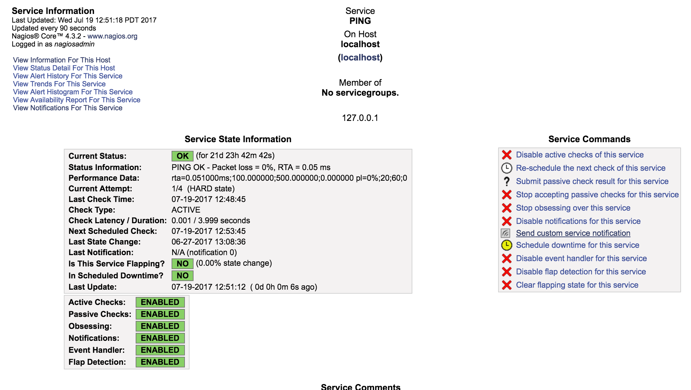

# Nagios Core
Nagios is the industry standard infrastructure monitoring tool. This integration expands the alerting capabilities of Nagios to leverage the xMatters communication protocols and integration platform for driving workflow across tools. 

---------

<kbd>
  
</kbd>

---------


# Pre-Requisites
* Nagios Core 4.3.x
* xMatters account - If you don't have one, [get one](https://www.xmatters.com)!

# Files
* [NagiosCommPlan.zip](NagiosCommPlan.zip) - Nagios comm plan with necessary the notification templates and integration scripts. 
* [xmatters.cfg](xmatters.cfg) - The contact and command entries for the xMatters notifications

# How it works
This integration uses a Nagios `command` to fire a curl request into the integration builder. The IB then builds the payload and creates the event. 

# Installation


## xMatters set up
1. Create a new user called `nagios` and grant the `Standard User`, `Limited Developer` and `REST Web Services User` roles.
2. Click the Login as This User and nagivate to the Developer tab. Click the Import Plan button and import the [NagiosCommPlan.zip](NagiosCommPlan.zip) file. If other users should be able to edit the scripts or forms going forward, click the Edit > Access Permissions on the Nagios Comm Plan and add the necessary users or roles. 
3. Click the Edit drop down next to the Nagios Comm Plan and click Integration Builder. Expand the Inbound services. Click the Copy Url link at the bottom and save the url for later. *Note* This is using URL Authentication which is not the most secure method. Update the authentication method as desired, but be sure to update the `curl` command below with the appropriate authentication info.

## Nagios set up

1. Login to the Nagios host machine and navigate to the `NAGIOS_HOME` directory. 
2. Copy the [xmatters.cfg](xmatters.cfg) file to the `NAGIOS_HOME/etc` directory. Open this file and replace the `XMATTERS_INBOUND_URL_HERE` value with the inbound url copied from above. *Note* If a different authentication method on the inbound integration was selected above, then the curl command will need to be updated. The `-u, --user` parameter will do basic auth or API Key auth. The syntax will be `--user "username:password"` See the curl help for more details. 
3. Open the `nagios.cfg` file and in the `OBJECT CONFIGURATION FILES` section, add this line, replacing `NAGIOS_HOME` with the full path to Nagios.

```
cfg_file=NAGIOS_HOME/etc/xmatters.cfg
```
4. Add the `xmatters` contact to the appropriate service by updating the service definition file. For example, to add xmatters to the ping service in the `NAGIOS_HOME/etc/objects/localhost.cfg`, add a `contacts` entry to make it look like this:

```cfg
define service{
    use                    local-service         ; Name of service template to use
    host_name              localhost
    service_description    PING
    check_command          check_ping!100.0,20%!500.0,60%
    contacts               xmatters
  }

```

4. Restart Nagios for the changes to take effect. 

## Adding xMatters to the template
Instead of adding the `xmatters` contact to each host and service entry, the contact can be added at the template level the host or service inherits from. In the `local-service` example above, instead of adding `xmatters` to the service, track down the template definition for `local-service`. 


# Testing
To test the integration, find a service that can be taken down for testing, or, alternatively, use the "Send custom service notification" on the service updated above. This is a screen shot of the PING service:

<kbd>
  
</kbd>


# Troubleshooting
The `nagios.cfg` file contains debug logging settings and the debug log information. Setting the `debug_level` to `256` and inspecting the `debug_file` file should show debug level information and any errors associated with the curl command. 

If the Activity Stream in xMatters shows the request coming in, then review the stream for any errors thrown. 

## NSS error -5938 Error
Some curl installations have reported a `NSS error -5938` error when making the curl request to xMatters. This can be solved by adding the `-1, --tlsv1` parameter to force TLS v1. For example:

```
define command {
        command_name    notify_xmatters_service
        command_line    curl --tlsv1 -X POST -H "Content-Type: application/json" -d '{ "NAGIOS_CONTACTGROUPNAME": "$SERVICEDISPLAYNAME$", "NAGIOS_HOSTDISPLAYNAME": "$HOSTDISPLAYNAME$", "NAGIOS_HOSTNAME": "$HOSTNAME$", "NAGIOS_HOSTOUTPUT": "$HOSTOUTPUT$", "NAGIOS_HOSTSTATE": "$HOSTSTATE$", "NAGIOS_LASTHOSTSTATECHANGE": "$LASTHOSTSTATECHANGE$", "NAGIOS_LASTSERVICESTATECHANGE": "$LASTSERVICESTATECHANGE$", "NAGIOS_NOTIFICATIONAUTHOR": "$NOTIFICATIONAUTHOR$", "NAGIOS_NOTIFICATIONCOMMENT": "$NOTIFICATIONCOMMENT$", "NAGIOS_NOTIFICATIONTYPE": "$NOTIFICATIONTYPE$", "NAGIOS_SERVICEDESC": "$SERVICEDESC$", "NAGIOS_SERVICEOUTPUT": "$SERVICEOUTPUT$", "NAGIOS_SERVICESTATE": "$SERVICESTATE$", "NAGIOS_TIMET": "$TIMET$" }' "XMATTERS_INBOUND_URL_HERE"
}
```

